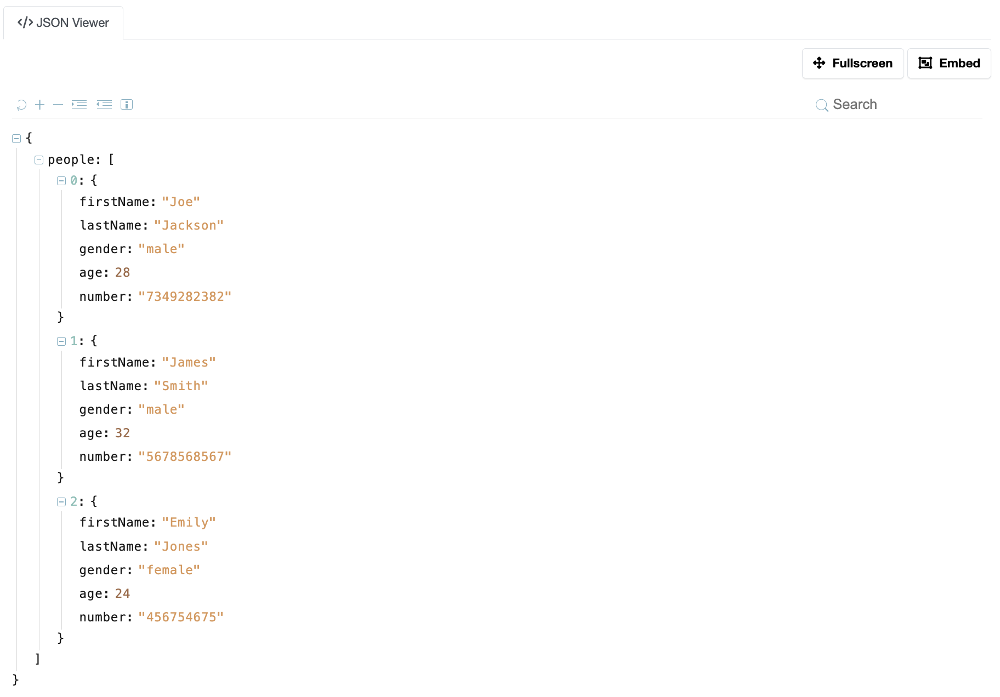

# ckanext-json-viewer

JSON view plugin




## Requirements

Compatibility with core CKAN versions:

| CKAN version    | Compatible?   |
| --------------- | ------------- |
| 2.9 and earlier | not tested    |
| 2.10+           | yes           |


## Installation

Install from source
```sh
pip install -e .
pip install -r requirements.txt
```

Or use `pip`
```sh
pip install ckanext-json-viewer
```

## Config settings

See [config declaration file](./ckanext/json_viewer/config_declaration.yml)

## Tests

To run the tests, do:
```sh
pytest --ckan-ini=test.ini
```

## License

[AGPL](https://www.gnu.org/licenses/agpl-3.0.en.html)
